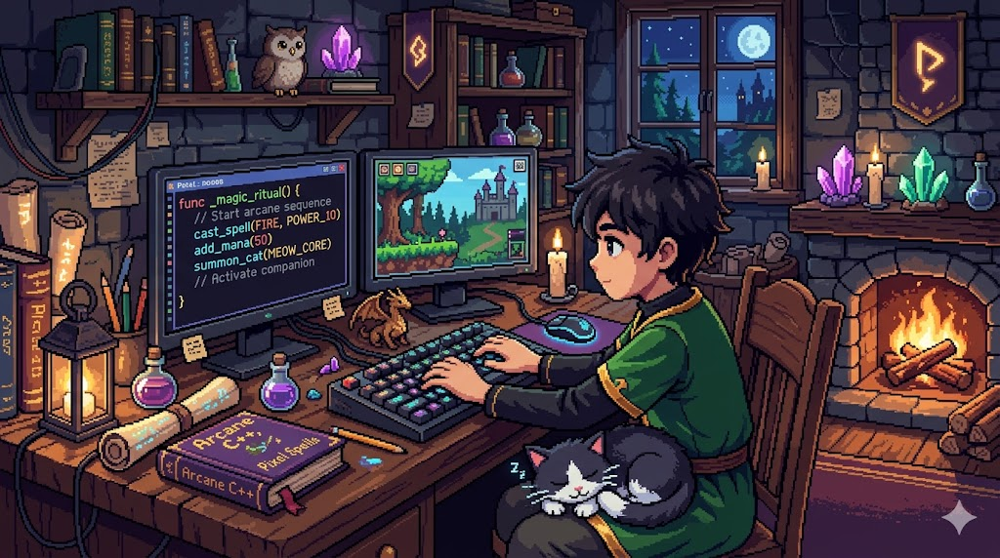

# Lab 04: DOM Manipulation 🧠



## Introduction

In Lab 03 you built a token estimation engine from scratch. You wrote five functions, tested each one with `console.log`, and ended up with a working page that had a textarea, a result paragraph, and a script linked at the bottom but nothing happened when you typed. That was on purpose.

This lab is where you bring it to life.

You will learn how JavaScript talks to the browser. Instead of running your functions in the console, you will connect them directly to the page so that when a user types text, the result updates in real time. Then you will go further: rather than returning a single number, you will return a structured **object** with multiple properties. And finally, you will use an **array** to store a history of analyses that the user can save and review.

By the end of this lab your token counter will feel like a real tool.

<br>

## Learning Objectives

* Select HTML elements using `document.querySelector`
* Listen for user interactions using `addEventListener`
* Read the current value of a textarea using `.value`
* Update the content of an element using `.textContent`
* Create objects with multiple properties using `{}`
* Access object properties using dot notation
* Declare an array and add items to it using `.push()`
* Loop over an array using `.forEach()`
* Create and add new elements to the page using `document.createElement` and `appendChild`

<br>

## Getting Started

### Previous work

You are going to continue working in the same project. You do not need to fork or clone anything new. Open your `tokenCounter.html` and `tokenCounter.js` files from Lab 03 everything you wrote there is your starting point.

<br>

## Part 1: Connecting to the DOM

Right now your `tokenCounter.js` runs five functions and logs results to the console. The page has no idea any of this is happening. In this part you will change that by selecting elements and reacting to what the user types.

<br>

### Step 1: Select the Elements

At the bottom of `tokenCounter.js`, below all your existing functions, add two new lines:

```js
const textarea = document.querySelector('#inputText');
const resultEl = document.querySelector('#result');
```

`document.querySelector` searches the page for the first element that matches the CSS selector you pass in. The `#` means you are looking for an element with that `id`. These two variables now hold a direct reference to the textarea and the result paragraph in your HTML.

Test it immediately. Add this line after:

```js
console.log(textarea);
console.log(resultEl);
```

Open `tokenCounter.html` in your browser and check the console. You should see the actual HTML elements printed out. If you see `null`, double-check that the `id` values in your HTML match exactly including capitalisation.

Remove the `console.log` lines once you have confirmed it works.

<br>

### Step 2: Listen for Input

Now add an event listener. This tells the browser: "whenever the user types anything into this textarea, run this function."

```js
textarea.addEventListener('input', ()=> {
  console.log('The user is typing!');
});
```

Open the page, type something into the textarea, and watch the console. You should see the message every time you press a key. This is the foundation of all interactive behaviour on the web.

<br>

### Step 3: Update the Result in Real Time

Now replace the `console.log` inside the listener with something useful. Read the textarea's current text using `.value`, pass it to `countTokens`, and write the result back to the page using `.textContent`:

```js
textarea.addEventListener('input', ()=> {
  const tokens = countTokens(textarea.value);
  resultEl.textContent = 'Estimated tokens: ' + tokens;
});
```

Save the file, refresh the browser, and start typing. The result paragraph should update with every keystroke.

Try pasting in a longer text a paragraph from an article or a few sentences you wrote earlier in the course. Watch the number climb.

<br>

## Part 2: Objects

Right now `countTokens` returns a single number. That is useful, but your users might also want to know how many words and characters they have typed. Instead of writing three separate functions and calling them one by one, you can return all the information together as a single **object**.

<br>

### Step 4: Write an analyzeText Function

An object in JavaScript is a collection of key-value pairs wrapped in curly braces. Add this new function to `tokenCounter.js`:

```js
function analyzeText(text) {
  const cleaned = cleanText(text);
  const words = splitIntoWords(cleaned);
  const filtered = removeEmptyWords(words);

  return {
    characters: cleaned.length,
    words: filtered.length,
    tokens: estimateTokens(filtered)
  };
}
```

The function runs the same pipeline you already know, but instead of returning just one value it returns an object with three properties: `characters`, `words`, and `tokens`.

Test it:

```js
console.log(analyzeText('Prepare for trouble, and make it double!'));
```

You should see something like `{ characters: 43, words: 9, tokens: 7 }` in the console. Try accessing individual properties:

```js
const result = analyzeText("It's super effective");
console.log(result.words);
console.log(result.tokens);
```

<br>

### Step 5: Update the HTML

Your current HTML has a single `<p id="result">`. Replace that with three separate elements so you can display each value independently:

```html
<div id="stats">
  <span id="stat-chars">Characters: 0</span>
  <span id="stat-words">Words: 0</span>
  <span id="stat-tokens">Estimated tokens: 0</span>
</div>
```

<br>

### Step 6: Update the Event Listener

Back in `tokenCounter.js`, select the three new elements and update the listener to use `analyzeText` instead of `countTokens`:

```js
const statChars  = document.querySelector('#stat-chars');
const statWords  = document.querySelector('#stat-words');
const statTokens = document.querySelector('#stat-tokens');

textarea.addEventListener('input', function() {
  const analysis = analyzeText(textarea.value);
  statChars.textContent  = 'Characters: ' + analysis.characters;
  statWords.textContent  = 'Words: '      + analysis.words;
  statTokens.textContent = 'Estimated tokens: ' + analysis.tokens;
});
```

Refresh the page and type. All three values should update together as you write.

<br>

## Part 3: Arrays

The counter is live. Now give users the ability to save a snapshot of their current analysis so they can compare different texts side by side. This is where arrays come in.

An **array** is an ordered list of items. You can add items to it, loop over it, and use it to keep track of things over time.

<br>

### Step 7: Add a Button and a History List to the HTML

In `tokenCounter.html`, below the `#stats` div, add a button and an empty list:

```html
<button id="save-btn">Save Snapshot</button>
<ul id="history-list"></ul>
```

<br>

### Step 8: Declare the History Array

At the bottom of `tokenCounter.js`, add:

```js
const history = [];
```

This is an empty array. Every time the user clicks the button you will push a new object into it.

<br>

### Step 9: Select the New Elements

Add two more selectors near the top of your DOM section:

```js
const saveBtn     = document.querySelector('#save-btn');
const historyList = document.querySelector('#history-list');
```

<br>

### Step 10: Save a Snapshot on Click

Add a click event listener to the button:

```js
saveBtn.addEventListener('click', function() {
  const analysis = analyzeText(textarea.value);
  analysis.label = 'Snapshot ' + (history.length + 1);
  history.push(analysis);
  renderHistory();
});
```

There are three things happening here:
1. You call `analyzeText` to get the current analysis object
2. You add a `label` property to it using `history.length + 1` so the first snapshot is labelled "Snapshot 1", the second "Snapshot 2", and so on
3. You push the object into the array and call `renderHistory` (which you will write next)

<br>

### Step 11: Write renderHistory

`renderHistory` is responsible for turning the array into visible HTML. Add it to `tokenCounter.js`:

```js
function renderHistory() {
  historyList.innerHTML = '';

  history.forEach(function(entry) {
    const li = document.createElement('li');
    li.textContent = entry.label + ' ' + entry.tokens + ' tokens, ' + entry.words + ' words, ' + entry.characters + ' characters';
    historyList.appendChild(li);
  });
}
```

Every time it runs, it first clears the list with `innerHTML = ''` and then re-builds it from scratch by looping over the array with `forEach`. Each item in the array becomes a new `<li>` element that is appended to the list.

Test it:
1. Type some text into the textarea
2. Click Save Snapshot a list item should appear
3. Change the text or add more
4. Click Save Snapshot again a second item should appear below the first

<br>

## HTML File Structure

Your updated `tokenCounter.html` should include:

```
<header> ... </header>
<nav> ... </nav>
<main>
  <section id="tokenCounter">
    <h2>Token Counter</h2>
    <p> ... </p>
    <textarea id="inputText"> ... </textarea>
    <div id="stats">
      <span id="stat-chars"> ... </span>
      <span id="stat-words"> ... </span>
      <span id="stat-tokens"> ... </span>
    </div>
    <button id="save-btn"> ... </button>
    <ul id="history-list"></ul>
  </section>
</main>
<footer> ... </footer>
```

<br>

## Bonus Challenges

* Add a **Clear History** button that sets `history.length = 0` and calls `renderHistory()` the list should disappear
* Find the highest token count across all snapshots using `history.map(function(e) { return e.tokens; })` and `Math.max`
* Disable the Save Snapshot button if the textarea is empty check `textarea.value.trim() === ''` inside the click listener before pushing
* Style the `#stats` div using the CSS variables from your stylesheet try giving each span a card-like appearance with `--color-surface`, `--radius`, and `--font-mono`

<br>

💟 **Happy coding!** 
